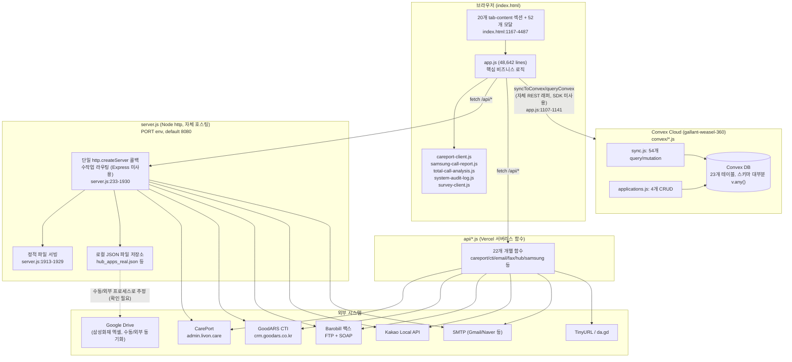
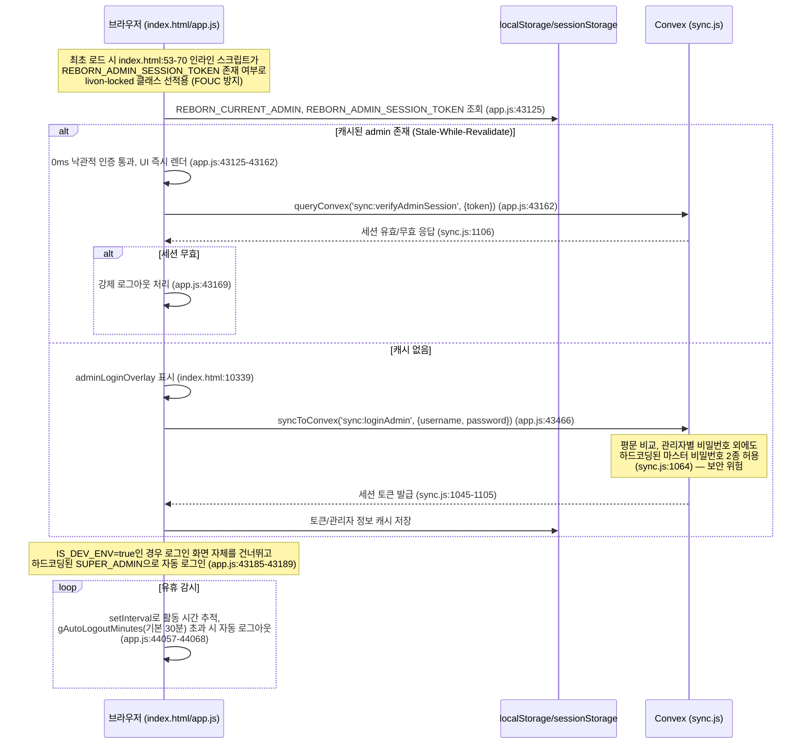
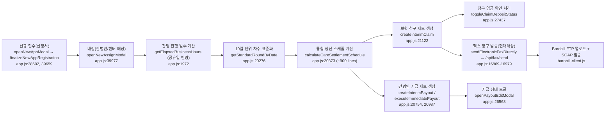
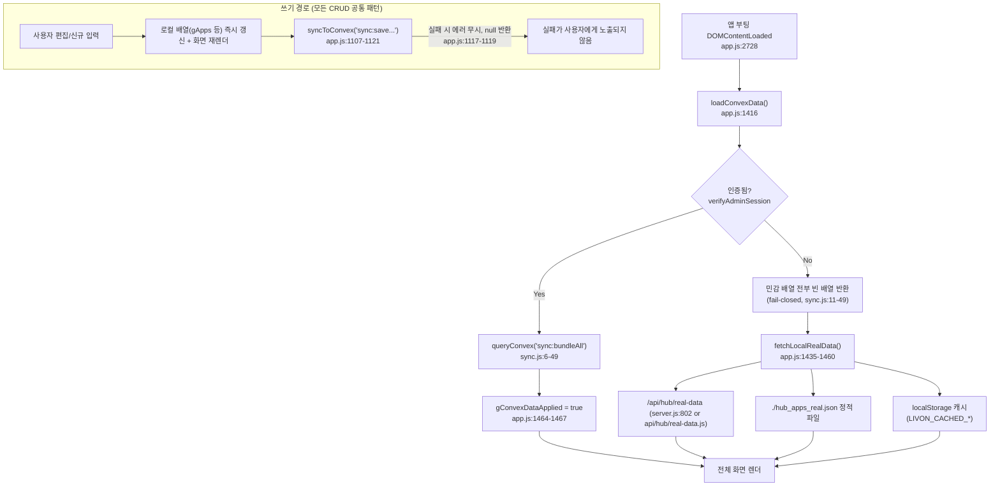

# 01. Architecture Discovery — 리본메이트 원 (Livon Mate One)

> **분석 기준**: git `main` 브랜치, 커밋 `1278873` 시점 소스코드 (분석일 2026-09-28)
> **작성 원칙**
> - 모든 서술은 실제 소스코드 근거(`파일:라인`)를 표기한다.
> - 코드로 확인되지 않고 정황상 추정한 내용에는 문장 끝에 **(추론)** 을 표기한다.
> - 코드만으로 결론 내릴 수 없는 항목은 **"확인 필요"** 로 명시한다.
> - 본 문서는 시스템 전체 지도(map)이며, 세부 기술부채/장애점 심층 분석은 후속 문서에서 다룬다.

---

## 0. 비즈니스 로직 다이어그램 (Mermaid)

### 0.1 시스템 전체 아키텍처

두 개의 서로 다른 실행/배포 경로가 코드베이스에 공존한다: (1) `server.js` 단일 Node 프로세스로 정적 파일 + API를 모두 서빙하는 로컬/자체 호스팅 경로, (2) `vercel.json` 기반으로 `api/*.js` 각각이 개별 서버리스 함수로 배포되는 Vercel 경로. 두 경로는 **거의 동일한 로직을 중복 구현**하고 있다 (server.js:267-369, 1783-1864 등에서 `api/samsung-drive/*` 로직이 서버 내부에도 복제되어 있음 — 확인 필요: 두 경로가 실제로 동시에 운영되는지, 아니면 Vercel만 운영되는지).



### 0.2 인증/세션 흐름 (확인된 코드 기준)



### 0.3 핵심 비즈니스 로직 — 간병 정산/청구 스케줄 산출 흐름

`app.js:20373` `calculateCareSettlementSchedule()` 는 약 900라인에 걸쳐 간병 일수 · 손해사정 청구 · 간병인 지급을 하나의 스케줄로 통합 계산하는 이 시스템의 중심 로직이다.



### 0.4 데이터 동기화 흐름 — Convex ↔ 로컬 JSON ↔ localStorage



---

## 1. 프로젝트 개요

### 애플리케이션의 목적
`package.json`에 명시된 공식 명칭은 **"Livon Mate One - Livon Care ERP System"** (package.json:2-4), README.md에는 **"(주)리본케어 통합 간병인 매칭 & 보험 정산 올인원 ERP 시스템"** 이라 기술되어 있다 (README.md:1-3). 코드 전반의 함수/변수/UI 텍스트(한글 주석·라벨)를 근거로, 다음 업무를 하나의 웹 애플리케이션에서 처리하는 것이 확인된다:

- 간병(요양보호) 고객 접수 및 간병인/센터 배정 관리 (app.js: TAB "carehub", "applications", "assignments")
- 보험사(현대해상·삼성화재)별 청구·정산 처리 및 팩스 발송 (app.js: "hyundaiClaimHub", "samsungClaimHub", 16714-19132 팩스 발송 섹션)
- 콜센터(CTI) 연동을 통한 상담 이력 관리 및 콜 분석 리포트 (cti-client.js, samsung-call-report.js, total-call-analysis.js)
- 간병일지(CarePort) 연동 및 PDF 문서 생성 (careport-client.js, api/careport/*)
- 고객 만족도 설문 및 리워드(포인트) 지급 (survey-service.js, survey-client.js, survey.html, mate-survey.html)
- 관리자 계정/권한(RBAC) 관리 및 시스템 감사 로그 (app.js: 43099-44128, system-audit-log.js)

### 주요 사용자
코드상 명시적인 "사용자 역할(Role)" 정의는 관리자 계정 데이터(`admins` 테이블, convex/schema.js:27)와 RBAC 메뉴 권한(app.js:43990 `applyAdminMenuPermissions`) 존재로 확인된다. 실제 조직 내 역할 구분(상담원/정산담당/관리자 등 구체적 명칭)은 UI 텍스트상 "손사"(손해사정사), "간병인", "센터" 등 업무 주체가 언급되나, 정확한 사용자 그룹 정의는 **확인 필요**(admins 테이블 스키마가 `v.any()`로 필드 강제가 없어 코드만으로 역할 체계를 완전히 특정하기 어려움).

- 리본케어 내부 상담원/사무직원 (고객 접수, 배정, 정산 처리) — (추론, UI 텍스트 기준)
- 시스템 관리자 (계정/권한/설정 관리) — admin 로그인 화면 및 RBAC 코드로 확인 (app.js:43099-44128)
- 외부 고객(간병 서비스 수혜자)은 `survey.html`/`mate-survey.html`을 통해 설문에만 익명 토큰 기반으로 접근 (server.js:1507-1531, 토큰 기반 공개 엔드포인트)

### 핵심 기능
index.html의 20개 탭 섹션(index.html:1167-4487)을 근거로 다음이 실제 구현된 기능이다:

| 기능 | 근거 |
|---|---|
| 통합 간병 운영 허브 | index.html:1167 `tab-carehub` |
| 간병 스케줄 캘린더 | index.html:1416 `tab-carecalendar`, app.js:44128-46531 |
| 삼성화재 명단관리(스프레드시트) | index.html:1919, app.js:4444-14285 |
| 삼성화재 청구/접수 허브 | index.html:2090 |
| 현대해상 청구 허브(팩스 청구) | index.html:2604, app.js:17865-19132 |
| 콜 분석 리포트(삼성/종합) | index.html:2796, 2801, samsung-call-report.js, total-call-analysis.js |
| 통합 디렉터리(간병인/센터/손사) | index.html:2806 |
| 팩스 관리(Barobill 연동) | index.html:3151, app.js:29520-32837 |
| CarePort 간병일지 PDF 관리 | index.html:3535, careport-client.js |
| 고객만족도 설문 관리 | index.html:3659, survey-service.js |
| 보험 청구 / 간병인 정산(지급) | index.html:4037, 4136, app.js:20255-29520 |
| 관리자 RBAC 및 감사로그 | index.html:4199 |

### 추정되는 서비스 형태
- 내부 조직(보험사 연계 간병 서비스 업체) 전용 **B2B 백오피스 ERP** 로 추정된다 (추론) — 로그인 게이트(index.html:53-70, 10339)가 전체 UI를 가리는 구조이며, 외부 고객 대상 화면은 익명 설문(survey.html)만 존재.
- 단일 페이지 애플리케이션(SPA)이 아닌, **20개 정적 섹션을 모두 DOM에 적재한 뒤 JS로 표시/숨김 전환**하는 "탭 전환형" 구조 (index.html 구조 분석 확인).
- 배포 대상으로 Vercel(`vercel.json`)과 자체 Node 서버(`server.js`, `start_server.ps1`) 두 가지가 코드상 모두 존재 — 실제 운영 환경이 무엇인지는 **확인 필요** (9장 참조).

---

## 2. 기술 스택

| 영역 | 기술 | 사용 위치 | 근거 | 확인 필요 |
|---|---|---|---|---|
| 백엔드 런타임 | Node.js (raw `http` 모듈, 프레임워크 미사용) | server.js | server.js:1 `require('http')`, server.js:233 `http.createServer` | Express 등 프레임워크 전환 계획 여부 |
| 서버리스 배포 | Vercel Functions | api/*.js, vercel.json | vercel.json:1-9 `functions: {"api/**/*.js"}` | server.js와 병행 운영 여부 |
| 백엔드(BaaS) | Convex (^1.45.0) | convex/*.js | package.json:11-13 `"convex": "^1.45.0"` | — |
| Convex 접근 방식 | 자체 fetch 래퍼 (공식 SDK `ConvexHttpClient` 미사용) | app.js:1107-1141 | app.js:1109 `fetch(\`${CONVEX_URL}/api/mutation\`)` | 의도된 설계인지, SDK 마이그레이션 누락인지 |
| 프런트엔드 | Vanilla JS (프레임워크 없음, React/Vue/Angular 미사용) | app.js, index.html | index.html 구조 분석 (섹션 0.1) | — |
| CSS | Tailwind CSS (CDN, 빌드 스텝 없음) | index.html:13 | `cdn.tailwindcss.com` | 프로덕션 성능/캐싱 이슈 |
| 폰트 | Pretendard (jsDelivr CDN) | index.html:11 | — | — |
| 아이콘 | Lucide (unpkg CDN) | index.html:34 | — | — |
| 차트 | Chart.js (jsDelivr CDN) | index.html:35, app.js (gInsuranceChart 등, app.js:1949-1950) | — | — |
| 지도/주소 | Kakao Maps SDK, Daum Postcode | index.html:36-37 | API 키가 URL 쿼리파라미터에 그대로 노출됨(`appkey=...`, 값은 보안상 본 문서에 재기재하지 않음) | 키 노출 위험도 평가(도메인 제한 설정 여부) |
| PDF 처리 | PDF.js, pdf-lib, html2canvas, html2pdf.bundle | index.html:38,41-44, app.js:35822-38386 | 로컬 vendored + CDN 폴백(index.html:45-52) | — |
| Excel 처리 | SheetJS(xlsx), ExcelJS | index.html:40-41, app.js 전역 `XLSX.*` 249회 | — | — |
| 압축 | JSZip | index.html:11181, careport-client.js:1551-1557 | — | — |
| 로컬 대용량 저장 | 커스텀 IndexedDB 래퍼(`LivonDB`) | app.js:4183 | "100,000+ Records without Quota Limits" 주석(app.js:4181) | — |
| 팩스 연동 | Barobill (FTP + SOAP) | barobill-client.js, server.js:1536-1778, api/fax/*.js | barobill-client.js:71,84 `ws.baroservice.com` | Aligo(알리고) 연동은 .env.example에 언급되나 실제 코드 경로 미확인 |
| CTI(콜센터) | GoodARS CTI (HTML 스크레이핑 기반) | cti-client.js | cti-client.js:95-97 `crm.goodars.co.kr` | 공식 API 미제공, 스크레이핑 의존 |
| 이메일 | 자체 구현 raw SMTP 클라이언트 (nodemailer 미사용) | smtp-client.js | smtp-client.js:1-2 `require('tls')`, `require('net')` | — |
| 외부 문서 서비스 | CarePort (admin.livon.care) | careport-client.js, api/careport/*.js | careport-client.js:28 | 자체 서비스인지 제휴사인지 확인 필요 |
| PDF 렌더링(서버) | 로컬 headless Microsoft Edge 실행 | pdf-helper.js | pdf-helper.js:5-8 (Windows 전용 경로) | Vercel(Linux) 배포 시 미동작 — api/samsung/call-report/pdf.js:32-34에서 폴백 처리 확인 |
| 주소 검색 | Kakao Local API | api/search-hospital.js | api/search-hospital.js:11-12 | — |
| URL 단축 | TinyURL, da.gd (공개 API) | api/shorten-url.js | api/shorten-url.js:66,77 | — |
| 패키지 매니저 | npm (package.json 단일 의존성: convex) | package.json | package.json:11-13 | 다른 의존성(xlsx 등)이 vendored/로컬 파일로 존재하는 이유 확인 필요 |
| 테스트 프레임워크 | 미발견 | — | 코드베이스 전체에서 test 러너/스펙 파일 미발견 | 테스트 전략 존재 여부 확인 필요 (13장 관련, 후속 문서) |

---

## 3. 디렉터리 구조

실제 파일 목록을 기준으로 각 디렉터리의 **책임**을 정리한다.

```
01. Livon_care_sys/
├── server.js                 # Node http 서버 — 로컬/자체호스팅 진입점 (정적서빙 + API + 로컬 JSON DB)
├── app.js                    # 프런트엔드 핵심 비즈니스 로직 (48,642줄, 브라우저 실행)
├── index.html                # SPA 셸 — 20개 탭 + 52개 모달의 정적 마크업
├── survey.html, mate-survey.html   # 고객 대상 설문 페이지 (익명 토큰 접근)
│
├── api/                       # Vercel 서버리스 함수 디렉터리 (server.js와 로직 중복/병행)
│   ├── careport/               # CarePort(간병일지) 연동: sync.js, detail.js
│   ├── cti/                    # GoodARS CTI 연동: call.js, config.js, logs.js
│   ├── email/, email-config.js, send-email.js, test-email.js  # SMTP 이메일 발송/설정
│   ├── fax/                    # Barobill 팩스 발송/상태조회: send.js, status.js
│   ├── hub/                    # 허브(고객/신청) 데이터 CRUD: create-application.js, real-data.js
│   ├── samsung/, samsung-drive/  # 삼성화재 콜리포트, 구글드라이브 엑셀 동기화
│   ├── total/                  # 전채널 통합 콜분석 동기화
│   ├── search-hospital.js      # Kakao 병원 검색 프록시
│   └── shorten-url.js          # URL 단축 프록시
│
├── convex/                    # Convex BaaS 백엔드 함수 정의
│   ├── schema.js                # 23개 테이블 스키마 (대부분 v.any())
│   ├── sync.js                  # 54개 query/mutation — 실질적 핵심 백엔드 로직
│   ├── applications.js          # applications 테이블 기본 CRUD (4개 함수)
│   ├── seed.js                  # 범용 시드/초기화용 mutation 2개
│   └── _generated/               # Convex 코드젠 산출물 (api.js, ai/guidelines.md 등)
│
├── (루트) 클라이언트/서버 공용 모듈들
│   ├── careport-client.js       # 브라우저: CarePort 연동 클라이언트 + PDF/ZIP 리포트 생성
│   ├── cti-client.js            # Node: GoodARS CTI 세션/콜로그 스크레이핑 + 콜 자동분류
│   ├── smtp-client.js           # Node: raw SMTP 클라이언트
│   ├── barobill-client.js       # Node: Barobill FTP/SOAP 클라이언트
│   ├── samsung-drive-helper.js  # Node: 구글드라이브 삼성 엑셀 탐색/복호화(Windows Excel COM 의존)
│   ├── survey-service.js        # Node: 설문 도메인 서비스(싱글턴), 로컬 JSON 저장
│   ├── survey-client.js         # 브라우저: 설문 관리자 UI 클라이언트
│   ├── samsung-call-report.js   # 브라우저: 삼성화재 전용 콜분석 리포트 모듈
│   ├── total-call-analysis.js   # 브라우저: 전채널 통합 콜분석 모듈 (setInterval 폴링 포함)
│   ├── system-audit-log.js      # 브라우저: 감사로그 (localStorage 기반, 서버 영속화 없음)
│   └── pdf-helper.js            # Node: headless Edge 기반 PDF 생성 + 폴백
│
├── data.js, hub_apps_real.json, call_report_*.json, call_annotations.json,
│   member_phone_map.json, samsung_call_report.json, samsung_drive_*.json
│                              # 로컬 파일 기반 "데이터베이스" — 사실상 1차 저장소로 사용되는 JSON 파일군
│
├── build_clean_dataset.js     # 1회성 ETL 스크립트 (특정 엑셀 → hub_apps_real.json)
├── migrate_audited_to_cloud.js # 1회성 ETL + Convex 마이그레이션 스크립트
│
├── hoon/                       # 원본 엑셀 관리대장 파일 보관 (작업자 개인 폴더로 추정, 추론)
│
├── *.min.js (exceljs, html2pdf.bundle, html2canvas, pdf-lib)  # 로컬 vendored 서드파티 라이브러리
│
├── .env.example, .env.local   # 환경변수 정의/실값
├── vercel.json                # Vercel 배포 설정 (서버리스 함수, 보안 헤더)
├── package.json                # 의존성(Convex 단일) 및 실행 스크립트
├── start_server.ps1            # 로컬 서버 구동용 PowerShell 스크립트
└── CLAUDE.md, AGENTS.md, README.md  # 프로젝트/AI 에이전트 안내 문서
```

**디렉터리 책임 요약**
- **`api/`**: Vercel 서버리스 배포 시의 라우트 단위. 각 파일이 하나의 HTTP 엔드포인트에 대응. **주의**: 상당 부분이 `server.js` 내부에도 동일 로직이 인라인으로 중복 구현되어 있음(예: samsung-drive, careport, fax) — 어느 쪽이 실제 소스오브트루스인지는 배포 방식에 따라 다름.
- **`convex/`**: Convex 클라우드에 배포되는 서버 함수. 인증(`loginAdmin`), 정산 데이터 CRUD, 대용량 삭제/초기화(launch reset) 로직 등 상당수 핵심 상태 변경 로직이 여기에 위치.
- **루트 `*-client.js` / `*-service.js`**: 특정 외부 시스템(CarePort/CTI/SMTP/Barobill) 당 하나씩 존재하는 통합 클라이언트 모듈. Node용과 브라우저용이 파일명 패턴으로는 구분되지 않으므로 각 파일의 실행 환경을 개별 확인해야 함(5장 참조).
- **JSON 데이터 파일들**: 정식 데이터베이스가 아님에도 불구, `hub_apps_real.json` 등은 서버 재시작 간에도 유지되는 **사실상의 1차 저장소**로 기능 (server.js:205, 918-988 등에서 직접 read/write).
- **`hoon/`**: 특정 개인(작업자)명으로 추정되는 폴더에 원본 엑셀이 보관됨 — 저장소에 커밋된 사유는 **확인 필요**.

---

## 4. 애플리케이션 진입점

코드에서 확인되는 실행 시작 지점은 다음 4가지 유형으로 구분된다.

### 4.1 Node 서버 부트스트랩 (`server.js`)
- 최상위 실행: `startServer(PORT)` 호출 — server.js:1954 (파일 최하단, 모듈 로드 즉시 실행)
- `PORT`는 `process.env.PORT`, 기본값 8080 — server.js:44
- `http.createServer(async (req, res) => {...})` 로 모든 요청을 단일 콜백에서 수작업 라우팅 — server.js:233
- 포트 충돌 시 자동으로 `port+1` 재시도 — server.js:1932-1939
- 정상 바인딩 시 OS 기본 브라우저를 `http://localhost:${port}/index.html`로 자동 실행(`child_process.exec`) — server.js:1941-1951
- `.env`/`.env.local`을 별도 라이브러리 없이 직접 파싱해 `process.env`에 주입하는 자체 로더가 다른 모든 로직보다 먼저 실행됨 — server.js:7-35

### 4.2 브라우저 SPA 진입점 (`index.html` → `app.js`)
- `document.addEventListener('DOMContentLoaded', async () => {...})` 가 클라이언트 측 실질적 진입점 — app.js:2726-2728
- 스크립트 로드 순서: jszip → data.js → careport-client.js → samsung-call-report.js → total-call-analysis.js → system-audit-log.js → survey-client.js → **app.js(최종, 2.49MB)** — index.html:11181-11188 (다른 모든 스크립트를 참조할 수 있도록 app.js가 항상 마지막에 로드되는 구조)
- 인증 게이트: 인라인 스크립트가 첫 페인트 이전에 `localStorage`의 세션 토큰 유무를 확인해 잠금 클래스를 선적용 — index.html:53-70

### 4.3 Vercel 서버리스 함수 (`api/*.js`)
- 각 파일이 Vercel의 `module.exports = (req, res) => {...}` 규약을 따르는 독립 엔드포인트로 추정됨(추론, Vercel 표준 규약 근거) — vercel.json:4-9에서 `api/**/*.js`를 함수로 등록
- 예: `api/hub/real-data.js`가 `GET/POST /api/hub/real-data` 에 대응

### 4.4 Convex 함수 (`convex/*.js`)
- Convex 배포 시 `sync.js`/`applications.js`/`seed.js`의 각 `export const` 항목이 개별 query/mutation 엔드포인트가 됨
- 로컬 개발 구동 명령: `npm run convex` → `node node_modules/convex/bin/main.js dev` — package.json:9

### 4.5 CLI/배치성 진입점 (수동 실행 전용)
- `build_clean_dataset.js`, `migrate_audited_to_cloud.js`: 함수 래핑 없이 파일 최상단에서 즉시 실행되는 구조, `node <file>.js` 로 수동 실행하는 1회성 ETL 스크립트로 확인됨 (`require.main` 가드나 CLI 인자 파싱 없음)
- `npm run dev` / `npm start` 모두 `node server.js` 로 동일 — package.json:7-8

### 스케줄러/워커
- **서버 사이드에는 스케줄러가 존재하지 않는다** — server.js 전체에서 `setInterval`/`setTimeout`/cron 패턴 미발견.
- **브라우저 사이드에만 폴링 형태의 준-스케줄러가 2곳 존재**:
  - `initSamsungDriveAutoSync()` — 삼성화재 구글드라이브 상태를 주기적으로 폴링 (app.js:13959, `gSamsungDriveSyncInterval`)
  - `total-call-analysis.js`: 미상담콜백 알림 30초 폴링, CTI 백그라운드 재동기화 5분 폴링 (total-call-analysis.js:4704-4730)
  - 위 둘은 모두 브라우저 탭이 열려 있을 때만 동작하는 클라이언트 사이드 타이머이며, 서버 프로세스와 독립된 실제 "배치 작업"은 아니다.

---

## 5. 핵심 컴포넌트

가장 중요도가 높은 모듈/함수를 실행 환경 기준으로 구분해 정리한다.

### 5.1 서버 사이드 (Node, `server.js` + 루트 `*-client.js`)

| 컴포넌트 | 책임 | 근거 |
|---|---|---|
| `server.js`의 요청 라우터 | 60개 이상 엔드포인트를 하나의 콜백에서 `if (reqPath === ...)` 로 수작업 분기 | server.js:233-1930 |
| `cti-client.js` | GoodARS CTI 로그인 세션 유지, 콜 목록/상세 HTML 스크레이핑, 8종 카테고리 자동분류 | cti-client.js:82-141(세션), 321-451(분류), 470-775(동기화) |
| `barobill-client.js` | Barobill FTP 업로드 + SOAP 팩스 발송/상태조회 | barobill-client.js:5-67(FTP), 69-197(SOAP) |
| `smtp-client.js` | nodemailer 없이 raw TLS 소켓으로 SMTP 프로토콜 직접 구현 | smtp-client.js:154-379 |
| `survey-service.js`의 `gSurveyService` 싱글턴 | 설문 전체 라이프사이클(토큰 발급, 응답 수집, 후속조치 티켓, 리워드 원장) | survey-service.js:195-745 |
| `samsung-drive-helper.js` | Windows Excel COM 자동화를 통한 암호화 엑셀 복호화 | samsung-drive-helper.js:112-184 |
| `pdf-helper.js` | headless Edge 기반 PDF 렌더링 + 실패 시 최소 PDF 바이트 직접 생성 폴백 | pdf-helper.js:18-137 |

### 5.2 백엔드(BaaS) 사이드 (Convex, `convex/sync.js`)

| 컴포넌트 | 책임 | 근거 |
|---|---|---|
| `bundleAll` query | 인증된 세션에 한해 전체 핵심 테이블을 한 번에 반환하는 부트스트랩 쿼리 (미인증 시 빈 배열 반환하는 fail-closed 가드 포함) | sync.js:6-49 |
| `loginAdmin` / `verifyAdminSession` / `logoutAdmin` | 인증/세션 발급·검증·만료 처리 | sync.js:1045-1169 |
| `save{Application,Assignment,Claim,Payout}` 계열 | 업무 핵심 엔티티의 upsert (업무 ID 기준) | sync.js:110-364 |
| `save*Chunk` / `purge*` 계열 | 엑셀 재적재(launch) 시 대량 upsert + "리스트에 없는 것은 삭제" 방식의 정합화 | sync.js:734-1033 |
| `saveSamsungEligibleChunk`/`Batch` | 25,939건 규모 데이터셋을 비용 문제로 **의도적으로 저장하지 않는 no-op** | sync.js:394-415 |

### 5.3 브라우저 사이드 (`app.js` 내 주요 엔진)

app.js는 48,642줄 단일 파일이나, 주석 헤더 기준으로 아래와 같은 기능 단위(엔진)로 명확히 구획되어 있다 (구획 근거: 섹션 0.1 다이어그램 및 구조 조사).

| 컴포넌트 | 책임 | 근거 |
|---|---|---|
| Convex 접근 래퍼 `syncToConvex`/`queryConvex` | 공식 SDK 대신 REST 엔드포인트(`/api/mutation`,`/api/query`)를 직접 fetch, 실패 시 에러를 삼키고 `null` 반환 | app.js:1107-1141 |
| `loadConvexData()` | 앱 부팅 시 Convex → 로컬 JSON → localStorage 순 폴백으로 초기 데이터 확보 | app.js:1416-1530 |
| `calculateCareSettlementSchedule()` | 간병일수·청구·지급을 통합 계산하는 정산 엔진 (~900줄, 이 시스템의 핵심 비즈니스 로직) | app.js:20373 |
| `LivonDB` (IndexedDB 래퍼) | localStorage 용량 한계를 넘는 대용량(10만 건 이상) 로컬 데이터 저장 | app.js:4183 |
| 삼성화재 워크플로우 엔진 | 명단관리 스프레드시트, 간병일지 첨부, 엑셀 내보내기, 이메일 발송, 구글드라이브 자동동기화 등 파일 내 최대 단일 기능군(약 1만 줄) | app.js:4444-14285 |
| 현대해상 청구 허브 | SMS 파싱, 고객 그룹핑, 팩스 청구 테이블 렌더링 | app.js:17865-19132 |
| 관리자 인증/RBAC/자동로그아웃 엔진 | 5.3의 세션 흐름(0.2 다이어그램) 전체 구현 | app.js:43099-44128 |
| 스마트 간병 캘린더 엔진 | 타임라인/월/주 단위 캘린더 렌더링 (2번째로 큰 모듈, ~2,400줄) | app.js:44128-46531 |
| 실데이터 런칭(엑셀/구글시트) 임포트 엔진 | 헤더 자동매핑, 대량 데이터 적용, Convex 동기화 트리거 | app.js:46531-48642 |

### 5.4 "감사 로그"에 대한 중요 발견
`system-audit-log.js`는 헤더 주석에서 "영구 기록"(permanent record)이라 자칭하나(system-audit-log.js:3-4), 실제로는 **서버 저장이 전혀 없는 순수 `localStorage` 기반 클라이언트 시뮬레이션**이며, `clearAuditLogs()` 함수로 사용자 스스로 삭제 가능하다(system-audit-log.js:809-833). 컴플라이언스 목적의 감사 추적으로는 사용할 수 없다 — 인수인계 시 반드시 인지 필요.

---

## 6. 시스템 데이터 흐름

사용자의 대표적 요청 하나(예: "신규 고객 접수" 또는 "청구 정보 조회")를 기준으로, 코드상 확인 가능한 범위 내에서 단계별로 기술한다.

### 6.1 화면 진입 및 인증
1. 브라우저가 `index.html`을 로드 → 인라인 스크립트가 `localStorage`의 세션 토큰 유무로 잠금화면 선적용 (index.html:53-70)
2. 하단에 나열된 스크립트가 순서대로 로드되고, 마지막으로 `app.js`가 로드되며 `DOMContentLoaded`에서 초기화 시작 (app.js:2726-2728)
3. `initAdminSession()` 이 캐시된 관리자 정보로 낙관적 인증 통과 후, 백그라운드에서 `queryConvex('sync:verifyAdminSession', ...)`로 재검증 (app.js:43125-43174, sync.js:1106)

### 6.2 초기 데이터 로드
4. `loadConvexData()` → `queryConvex('sync:bundleAll')` 호출 (app.js:1416, sync.js:6)
5. Convex `bundleAll`은 서버 사이드에서 세션 토큰을 검증한 뒤, 유효하면 applications/assignments/claims/payouts 등 핵심 테이블 전체를 반환 (sync.js:11-101)
6. 실패/미인증 시 `hub_apps_real.json`(서버 정적 파일 또는 `/api/hub/real-data`) 및 `localStorage` 캐시로 순차 폴백 (app.js:1435-1519)
7. 로드된 데이터는 전역 배열(`gApps`, `gAssigns`, `gClaims`, `gPayouts` 등, app.js:1039-1070)에 적재되고 각 탭 렌더 함수가 호출됨

### 6.3 사용자 조작 (예: 신규 고객 접수)
8. `openNewAppModal()` → 사용자가 폼 입력 → `handleNewAppSubmit()` (app.js:38602, 39404)
9. 입력값은 즉시 로컬 배열에 반영되어 화면이 먼저 갱신됨 (낙관적 UI)
10. `finalizeNewAppRegistration()` 이 `POST /api/hub/create-application` 호출 (app.js:39659-39730) → server.js 또는 api/hub/create-application.js가 `hub_apps_real.json`에 append (server.js:939-969 / api/hub/create-application.js:35-64)
11. 동시에 `syncToConvex('sync:saveApplication', ...)` 로 Convex에도 upsert 시도 (sync.js:110) — 이 호출이 실패해도 에러가 사용자에게 노출되지 않고 조용히 무시됨 (app.js:1117-1119)

### 6.4 후속 업무 처리 (배정 → 정산 → 청구)
12. 배정(`openNewAssignModal`) → `calculateCareSettlementSchedule()` 이 간병일수·차수를 재계산 (app.js:20373)
13. 청구 세트가 생성되면(`createInterimClaim`, app.js:21122) 필요 시 팩스 발송 트리거
14. `sendElectronicFaxDirectly()` → `POST /api/fax/send` (app.js:16869-16979) → server.js 또는 api/fax/send.js가 PDF 생성(pdf-helper.js) 후 Barobill FTP 업로드+SOAP 호출 (barobill-client.js)
15. 발송 결과가 다시 화면에 반영되고, 필요 시 청구/지급 상태가 토글됨 (app.js:27437, 26568)

### 6.5 콜 연동 흐름 (참고)
16. 상담원이 클릭투콜 버튼 클릭 → `handleTriggerCtiCall()` → `POST /api/cti/call` (app.js:19832) → `cti-client.js`의 `makeOutboundCall()` 이 GoodARS CTI에 세션 로그인 후 발신 요청 전달 (cti-client.js:151-226)
17. 콜 종료 후 `total-call-analysis.js`/`samsung-call-report.js`가 주기적/수동 동기화로 콜로그를 가져와 로컬 JSON(`call_report_*.json`)과 화면에 반영

**공통 패턴 요약**: 이 시스템의 데이터 흐름은 거의 전 구간에서 "① 로컬 상태 즉시 갱신 → ② 화면 즉시 반영 → ③ 백그라운드로 Convex/로컬파일에 비동기 동기화, 실패해도 조용히 무시" 의 낙관적(optimistic) 패턴을 따른다. 이는 응답성은 높이지만, **동기화 실패가 사용자에게 드러나지 않아 데이터 정합성 문제를 조기에 발견하기 어려운 구조**다.

---

## 7. 외부 시스템

| 외부 시스템 | 용도 | 호출 위치 | 근거 |
|---|---|---|---|
| **Convex Cloud** (`gallant-weasel-360.convex.cloud`) | 원격 데이터베이스(BaaS). 인증, 핵심 엔티티 CRUD, 대량 초기화 | app.js:1107-1141(fetch 래퍼), convex/sync.js 전체 | app.js:1081, .env.example:7 |
| **CarePort** (`admin.livon.care`) | 간병일지(care note) 조회/목록 연동. 자체 서비스로 추정되나 제휴사 시스템일 가능성도 있음(확인 필요) | careport-client.js:28,56,110,177 / api/careport/sync.js, detail.js / server.js:1043-1077 | careport-client.js:28 |
| **GoodARS CTI** (`crm.goodars.co.kr`) | 콜센터 연동: 클릭투콜 발신, 콜로그 조회(HTML 스크레이핑), 콜 자동분류 | cti-client.js:95-786 / api/cti/*.js / server.js:613-683 | cti-client.js:95-97 |
| **Barobill** (`ws.baroservice.com`, FTP) | 전자팩스 발송(FTP 업로드 + SOAP), 잔액/상태 조회 | barobill-client.js / api/fax/*.js / server.js:1536-1778 | barobill-client.js:71,84 |
| **Kakao Local API / Kakao Maps / Daum Postcode** | 병원 검색, 지도/주소 검색 | api/search-hospital.js:11-12, index.html:36-37, app.js:660-742 | — |
| **SMTP 서버** (Gmail/Naver 등, 설정에 따라 가변) | 이메일 발송(리포트, 알림, 설정 테스트) | smtp-client.js / api/send-email.js, test-email.js / server.js:521-608 | smtp-client.js:22-23 |
| **TinyURL / da.gd** | URL 단축 (자체 `/api/shorten-url` 실패 시 공개 API로 폴백) | api/shorten-url.js:66,77 / samsung-call-report.js:3351-3371 | — |
| **Google Drive** (링크만 존재, 실제 API 호출은 미발견) | 삼성화재 엑셀 파일 공유 폴더 | api/samsung-drive/status.js:9,33 | 실제 자동 동기화 메커니즘은 **확인 필요** — `samsung_drive_latest.json`을 누가/어떻게 생성하는지 api/ 코드 내에서 writer가 발견되지 않음 |
| **api.ipify.org** | 클라이언트 공인 IP 조회 (감사로그 표시용, 신뢰 불가한 클라이언트 사이드 감사로그의 일부) | app.js:43494, system-audit-log.js:16-26 | — |
| **로컬 headless Microsoft Edge** | 서버 사이드 PDF 렌더링(팩스 문서 등) | pdf-helper.js:5-8,54 | Windows 전용 경로, Vercel(Linux) 배포 시 미동작하여 자동 폴백 처리됨 (api/samsung/call-report/pdf.js:32-34) |

**주의**: 위 표의 외부 연동 중 Database(RDBMS)/Redis/전통적 Message Queue/결제 시스템은 코드베이스 전체에서 **발견되지 않았다** — 데이터 저장은 Convex(BaaS) + 로컬 JSON 파일 조합으로만 이루어진다.

---

## 8. 설정 및 환경변수

`.env.example`(.env.example:1-33)과 코드 전반의 `process.env` 참조를 근거로, "어떤 secret이 어디서 쓰이는가"만 정리한다 (실값은 기재하지 않음).

| 환경변수 | 용도 | 사용 위치 |
|---|---|---|
| `PORT` | Node HTTP 서버 리슨 포트 (기본 8080) | server.js:44 |
| `CONVEX_URL` | Convex 백엔드 엔드포인트 | app.js는 이 값을 직접 읽지 않고 URL을 하드코딩 분기(app.js:1080-1081) — **불일치 확인 필요**: .env.example에는 존재하나 프런트엔드는 실제로 환경변수가 아닌 호스트 휴리스틱으로 dev/prod URL을 자체 결정함 |
| `CAREPORT_ID` / `CAREPORT_PW` | CarePort 로그인 자격증명 | server.js:31-32(기본값 하드코딩 존재), careport-client.js:29-32(브라우저 파일에도 폴백 자격증명 하드코딩), api/careport/*.js |
| `KAKAO_REST_KEY` | Kakao Local API 인증 헤더 | server.js:61, api/search-hospital.js:3(하드코딩 폴백 존재) |
| `FAX_SENDER_NUMBER` | 팩스 기본 발신번호 | server.js:1553,1775, api/fax/status.js:105 |
| `CTI_BASE_URL`/`CTI_ID`/`CTI_PASS`/`CTI_CALLER_ID` | GoodARS CTI 접속 정보 (설정 파일이 없을 때만 폴백으로 사용) | cti-client.js:24-27 |
| `SAMSUNG_EXCEL_PASSWORD` | 삼성화재 엑셀 복호화 암호 | samsung-drive-helper.js:20 |
| `BAROBILL_SERVER` | Barobill 서버 라벨 표시용 | api/fax/status.js:106 |
| (Barobill 계정 정보: certKey/corpNum/baroId/baroPwd) | Barobill 팩스 발송 인증 | **환경변수가 아닌 소스코드 하드코딩 값**으로 존재 — server.js:1582-1588,1711-1713, api/fax/send.js:54-57, api/fax/status.js:14-15 |

**설정 파일(로컬 JSON, secret 포함 가능)**
| 파일 | 용도 | 저장 위치 근거 |
|---|---|---|
| `fax_config.json` | Barobill 계정 정보 저장 | server.js:372-401 |
| `cti_config.json` | GoodARS CTI 계정 정보 저장 | cti-client.js:6,16-48 |
| `email_config.json` | SMTP 계정 정보 저장 | smtp-client.js:6,11-46 |
| `samsung_drive_config.json` / `samsung_drive_latest.json` | 구글드라이브 동기화 상태/캐시 | samsung-drive-helper.js:18-60, server.js:305-347 |

**핵심 발견**: CarePort, Kakao, Barobill 3개 외부 시스템의 인증 정보가 **환경변수 미설정 시 사용되는 기본값 형태로 소스코드에 직접 하드코딩**되어 있다(server.js:31-32, 1582-1588, api/fax/send.js:54-57, api/search-hospital.js:3, careport-client.js:29-32). `.env.example`이 존재함에도 실제로는 코드 자체가 secret을 내장하고 있어, 환경변수 설정 여부와 무관하게 자격증명이 저장소에 노출되어 있는 상태다. 이는 보안 관점에서 우선적으로 조치가 필요한 사항이다 (상세 분석은 후속 보안 문서에서 다룰 것을 권고).

Convex 관련 환경변수(`CONVEX_URL`, 주석 처리된 `CONVEX_DEPLOYMENT`)는 `.env.example`에 정의되어 있으나(.env.example:6-13), 실제 프런트엔드 코드(app.js:1079-1105)는 이를 읽지 않고 URL을 소스에 하드코딩한 뒤 호스트명/URL 파라미터/localStorage 값으로 dev/prod를 분기한다 — **문서화된 설정 방식과 실제 구현이 불일치**하는 부분으로 확인 필요.

---

## 9. 실행 및 배포 구조

코드에서 확인 가능한 범위 내에서 정리하며, 각 항목에 선정 근거를 명시한다. 추측이 필요한 부분은 별도 표기한다.

### 9.1 로컬 개발 환경
- 실행 방법: `powershell -ExecutionPolicy Bypass -File ./start_server.ps1` 또는 `node server.js` (README.md:12-18)
- `npm run dev` / `npm start` 모두 `node server.js` 실행과 동일 (package.json:7-8) — 별도의 개발/운영 모드 분기(`NODE_ENV` 등)는 **server.js 내에서 발견되지 않음**
- 브라우저 접속: `http://localhost:8080` (README.md:19, server.js 기본 PORT=8080과 일치)
- Convex 로컬 개발 서버: `npm run convex` (package.json:9) — 이 역시 Convex 클라우드와 연동되는 개발 배포이며, 완전한 로컬(오프라인) DB는 아닌 것으로 추정됨(추론, Convex의 일반적 아키텍처 특성상)

### 9.2 운영/배포 구조 — 두 가지 경로가 코드상 공존
**선정 이유**: `vercel.json`(서버리스 함수/보안 헤더 설정)과 `server.js`(자체 Node 서버, 정적파일+API 일체형)가 각각 완결된 형태로 저장소에 함께 존재하며, 상당수 API 로직이 양쪽에 중복 구현되어 있다는 사실(예: `/api/samsung-drive/*`가 server.js:267-369, 1783-1864에 두 번, `api/samsung-drive/*.js`에 한 번 더 존재)이 근거다.

1. **Vercel 서버리스 배포 경로 (추정 운영 환경, 추론)**
   - `vercel.json`이 `api/**/*.js`를 30초 타임아웃의 서버리스 함수로 등록 (vercel.json:4-9)
   - HSTS, X-Frame-Options 등 프로덕션 지향 보안 헤더가 전역 설정됨 (vercel.json:10-41) — 이는 실제 공개 운영을 염두에 둔 설정으로 보임(추론)
   - 정적 파일(`index.html`, `app.js` 등)은 Vercel의 정적 호스팅으로 서빙되는 것으로 추정(추론, Vercel 표준 동작 방식 근거) — Vercel 프로젝트 설정 자체는 저장소에 없어 **확인 필요**
   - 이 경로에서는 `pdf-helper.js`의 headless Edge 의존 기능, `samsung-drive-helper.js`의 Windows Excel COM 의존 기능이 **동작하지 않을 가능성이 높음** (Linux 서버리스 런타임과 Windows 전용 바이너리 의존성 충돌) — 코드 내 `api/samsung/call-report/pdf.js:32-34`가 이에 대한 명시적 폴백 처리를 포함하고 있어, 개발팀도 이 제약을 인지하고 있었던 것으로 보인다.

2. **자체 Node 서버 배포 경로 (로컬/온프레미스 용도로 추정, 추론)**
   - `server.js`가 정적 파일 서빙과 API를 동일 프로세스에서 처리 (server.js:233-1930)
   - Windows 전용 기능(Excel COM 자동화, headless Edge 실행 경로)이 정상 동작하려면 이 경로가 Windows 서버/PC에서 실행되어야 함 — `samsung-drive-helper.js:10-16`의 하드코딩된 `G:\`, `H:\` 드라이브 경로가 특정 업무용 PC/서버 환경에 강하게 결합되어 있음을 시사 (추론)
   - `.env.local` 파일이 저장소에 실존(`.env.local` 파일 확인됨) — 로컬 또는 특정 온프레미스 환경에서 직접 실행되고 있을 가능성이 높음(추론)

**결론(추론)**: 정적 UI + 대부분의 API는 Vercel로 배포되고, Windows 종속 기능(엑셀 자동복호화, Edge PDF 렌더링, 콜 스크레이핑 등 장시간 작업)은 사무실 내 Windows PC에서 `server.js`를 직접 구동해 처리하는 **이원화된 운영 구조**일 가능성이 있다. 그러나 이는 코드만으로 확정할 수 없으므로 **반드시 실제 운영팀에 확인이 필요하다.**

### 9.3 CI/CD
- `.github/workflows` 등 CI 설정 파일이 저장소에서 **발견되지 않음** — 자동화된 빌드/테스트/배포 파이프라인 존재 여부 확인 필요.
- Vercel은 일반적으로 Git 푸시 시 자동 배포되므로(Vercel 표준 동작, 추론), 별도 CI 없이 Vercel 자체 배포 트리거에 의존하고 있을 가능성이 있다.

### 9.4 데이터베이스 마이그레이션/시드
- `convex/seed.js`가 범용 시드/초기화 mutation을 제공하나(seed.js:5-34), 정식 마이그레이션 도구(예: 버전 관리되는 스키마 마이그레이션)는 **발견되지 않음**.
- `migrate_audited_to_cloud.js`가 로컬 엑셀 데이터를 Convex로 이관하는 수동 스크립트로 확인되며, 이는 일회성 데이터 이관 도구이지 반복 가능한 마이그레이션 체계는 아니다.

---

## 부록: 후속 분석이 필요한 주요 "확인 필요" 항목 목록

1. Vercel과 server.js 중 실제 프로덕션 트래픽을 받는 경로가 무엇인지 (9.2)
2. `samsung_drive_latest.json`을 실제로 생성/갱신하는 외부 프로세스의 정체 (api/samsung-drive/sync.js 관련)
3. `admins`/사용자 역할 체계의 정확한 정의 (스키마가 `v.any()`로 강제되지 않음)
4. `hoon/` 폴더가 저장소에 존재하는 이유 및 민감정보 포함 여부
5. `survey*` 5개 Convex 테이블이 완전히 정의되어 있음에도 `convex/sync.js`에서 관련 함수가 전혀 발견되지 않는 이유 (survey 기능은 로컬 JSON(`survey_data.json`) 기반 `survey-service.js`로만 동작 중인 것으로 보임)
6. `app.js`가 호출하는 `sync:updateCustomerField`, `sync:saveClaimUnitPriceRules` 두 Convex 경로가 `convex/sync.js`에 정의되어 있지 않아 항상 조용히 실패하고 있는 것으로 보이는 문제 (silent no-op)
7. `convex/sync.js`의 `resetSamsungCareLedger`가 미선언 변수를 반환문에서 참조해 런타임 에러가 발생할 것으로 보이는 문제

> 위 항목 및 하드코딩된 자격증명(8장), 중복 라우트(3장), 클라이언트 전용 감사로그(5.4) 등 구체적인 기술부채·장애 가능 지점은 후속 인수인계 문서에서 심층적으로 다룰 예정이다.
